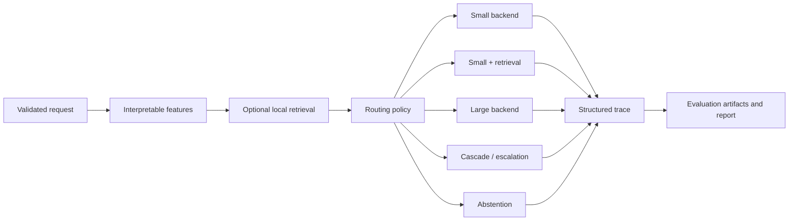

# BudgetRoute-LLM

BudgetRoute-LLM is a quality-aware language-model inference system. It estimates request difficulty, optionally retrieves local context, and selects a small model, larger model, retrieval-assisted small model, confidence cascade, or abstention. Its experiment harness measures the resulting quality–latency trade-off rather than assuming one policy is universally best.

> **Status: v0.1 alpha implementation. No official benchmark results are available.** Run a real-model experiment on your own hardware before making performance claims. Fake mode validates the complete software path but is not model-performance evidence.

## Problem and research questions

Language-model deployments often send every prompt to one model, even when requests differ sharply in difficulty and context needs. BudgetRoute-LLM asks:

> Can a quality-aware routing policy reduce average inference latency and compute usage while keeping answer quality above a configured target?

The project also examines where retrieval helps, when cascade escalation is precise, how confidence calibration affects routing, and how thresholds move quality, coverage, latency, and compute together.

## Architecture



Protocols decouple generation backends, embedders, retrievers, policies, and evaluators. Pydantic schemas form the boundaries; YAML composition selects implementations. See [architecture](docs/architecture.md).

## Features

- Four explicit modes: deterministic fake, real CPU smoke, local GPU, and FastAPI service.
- Fixed, seeded-random, heuristic, learned, retrieval-first, and cascade policies.
- Deterministic feature extraction with no target leakage.
- Portable NumPy exact-cosine retrieval plus optional FAISS packaging support.
- Lazy Transformers model loading, CPU/CUDA selection, mixed precision, optional quantization, and `torch.compile` controls.
- Exact match, token F1, numeric, classification, keyword, abstention, routing, selective, and calibration metrics.
- High-resolution route/retrieval/generation/total timing, token usage, RSS, and optional peak CUDA memory.
- Unique, atomic experiment artifacts and reports generated only from saved results.
- Offline tests, FastAPI endpoints, async microbatching, Docker, CI, and Windows/Unix scripts.

## Execution modes

| Mode | Purpose | Network/GPU needed? | Configuration |
|---|---|---|---|
| Fake | Tests, CI, demos, API smoke | No | `configs/serving/fake.yaml` |
| CPU smoke | Validate Transformers integration | Model download, no GPU | `configs/benchmarks/cpu-smoke.yaml` |
| Local GPU | Real quality/performance experiments | Model download and CUDA | `configs/benchmarks/full.yaml` |
| API | Serve any of the above | Depends on selected config | `configs/serving/*.yaml` |

Fake answers, confidence, and artificial latency are deterministic and marked `fake: true`. They must never be reported as real performance.

## Repository map

```text
src/budgetroute/      package: backends, retrieval, routing, inference, evaluation, API
configs/              composable model, routing, benchmark, and serving YAML
data/                 original development corpus and 12-record benchmark
tests/                offline unit, integration, and timing tests
docs/                 architecture, methods, operations, decisions, execution plans
scripts/              PowerShell and Bash setup/check/demo entry points
outputs/              ignored experiment directories; only .gitkeep is tracked
.github/workflows/    quality, packaging, and clearly labeled fake-smoke CI
```

## Installation

Python 3.11 or 3.12 is the primary target. Python 3.13 is accepted by the package and used by the initial local validation.

### Windows PowerShell

```powershell
py -3.12 -m venv .venv
.\.venv\Scripts\python -m pip install --upgrade pip
.\.venv\Scripts\python -m pip install -e ".[dev]"
```

Or run `powershell -ExecutionPolicy Bypass -File scripts/bootstrap.ps1`.

### Linux or macOS

```bash
python3.12 -m venv .venv
./.venv/bin/python -m pip install --upgrade pip
./.venv/bin/python -m pip install -e '.[dev]'
```

Or run `bash scripts/bootstrap.sh`. Neither script pretends that activation persists after it exits.

Install optional real-model support with `pip install -e '.[dev,transformers]'`. The `all` extra adds API, learned-router, reporting, Transformers, and GPU helper dependencies; platform-specific quantization support may still require separate setup.

## Quick fake demo

```powershell
.\.venv\Scripts\python -m budgetroute demo --config configs/serving/fake.yaml
```

```bash
./.venv/bin/python -m budgetroute demo --config configs/serving/fake.yaml
```

The five cases demonstrate easy-to-small, difficult-to-large, retrieval, cascade escalation, and abstention. Timing is simulated.

## Fake benchmark and report

```bash
python -m budgetroute benchmark --config configs/benchmarks/fake-smoke.yaml
python -m budgetroute generate-report --latest
```

The run writes `config.resolved.yaml`, environment/Git metadata, predictions, routes, timings, errors, metrics, Markdown/CSV, and PNG figures under an ignored `outputs/<UTC>_fake-smoke/` directory. Reports carry a prominent fake warning.

## CPU smoke test

```bash
pip install -e '.[transformers,reporting]'
python -m budgetroute doctor --config configs/benchmarks/cpu-smoke.yaml
python -m budgetroute benchmark --config configs/benchmarks/cpu-smoke.yaml
```

This may download the configurable SmolLM2 examples from Hugging Face. It is deliberately excluded from default tests. Review model licenses and cache requirements before use.

## Local GPU benchmark

```bash
pip install -e '.[all]'
python -m budgetroute doctor --config configs/benchmarks/full.yaml
python -m budgetroute benchmark --config configs/benchmarks/full.yaml
```

The example Qwen model sizes are configuration examples, not claims that they fit every GPU. Adjust identifiers, precision, quantization, generation length, batch size, and measured runs for available VRAM. Explicit CUDA requests never silently fall back to CPU.

## CLI

Both `budgetroute ...` and `python -m budgetroute ...` work.

```text
doctor             inspect dependencies, CUDA, config, and output access
validate-config    resolve and validate YAML composition
inspect-data       validate benchmark JSONL and show category counts
build-index        build and persist the configured retrieval index
benchmark          run configured policies and save artifacts
train-router       train a fake-demo or real learned router from artifacts
evaluate-router    evaluate persisted router predictions and calibration
generate-report    create report files from existing artifacts only
serve              start FastAPI with the selected configuration
demo               run the offline five-case fake demonstration
```

Use `python -m budgetroute COMMAND --help` for options.

## API

Start fake mode:

```bash
python -m budgetroute serve --config configs/serving/fake.yaml
```

Endpoints are `GET /healthz`, `GET /readyz`, `GET /v1/config`, `POST /v1/route`, and `POST /v1/generate`.

```bash
curl -s http://127.0.0.1:8000/healthz
curl -s -X POST http://127.0.0.1:8000/v1/route \
  -H 'Content-Type: application/json' \
  -d '{"prompt":"What is the capital of France?"}'
curl -s -X POST http://127.0.0.1:8000/v1/generate \
  -H 'Content-Type: application/json' \
  -d '{"prompt":"According to the project corpus, what is the internal project codename?","requires_retrieval":true}'
```

OpenAPI is available at `/docs`. This initial service has prompt limits and safe errors but no authentication or rate limiting; add them before public exposure.

## Dataset format

Each UTF-8 JSONL line includes `id`, `category`, `prompt`, `reference_answer`, `evaluation_type`, `requires_retrieval`, `must_abstain`, and `metadata`:

```json
{"id":"numeric_001","category":"numeric_reasoning","prompt":"A box contains 12 items and 3 are removed. How many remain?","reference_answer":"9","evaluation_type":"numeric","requires_retrieval":false,"must_abstain":false,"metadata":{}}
```

The bundled 12-record sample validates architecture only. It is original project data, not a conclusive benchmark. See [data guidance](data/README.md).

## Routing policies

- `always_small` and `always_large`: cost/quality baselines.
- `random`: seeded deterministic selection with configurable probabilities.
- `heuristic`: transparent request length, math/code, output length, category, and retrieval rules.
- `learned`: persisted scikit-learn prediction of small-model success.
- `retrieval_first`: queries local context before backend selection.
- `cascade`: runs small first and escalates below a configured confidence threshold.
- Abstention is a route emitted when required context or answerability is insufficient.

See [routing](docs/routing.md) for failure modes and threshold interpretation.

## Evaluation metrics

Quality includes normalized exact match, token F1, numeric correctness, classification accuracy, keyword coverage, abstention correctness, routing accuracy, escalation precision/recall, false escalation/non-escalation, coverage, selective accuracy, Brier score, expected calibration error, and reliability bins.

Systems measurements include p50/p95 (and p99 when sample size permits), routing/retrieval/generation/total latency, TTFT where available, throughput, token counts/rate, RSS, optional peak CUDA memory, failures, escalations, and route shares. Definitions and edge cases are in [evaluation](docs/evaluation.md).

## Reproducibility

Every run records UTC ID, configuration and dataset hashes, resolved configuration, seed, package version, backend metadata, environment/hardware, Git commit and dirty state when available, warm-up/measured counts, batch size, and concurrency. Model download time is excluded from steady-state timing. See [reproducibility](docs/reproducibility.md).

## Development and testing

```bash
python -m ruff format --check .
python -m ruff check .
python -m mypy src
python -m pytest
python -m pytest --cov=budgetroute --cov-report=term-missing --cov-fail-under=75
python -m build
```

PowerShell users can run `scripts/check.ps1`; Unix users can run `scripts/check.sh`. Ordinary tests do not use the network, CUDA, Docker, Hugging Face authentication, or model downloads.

## Docker

```bash
docker compose up --build
curl http://127.0.0.1:8000/readyz
```

The CPU-safe image runs fake API mode as a non-root user and downloads no models during build. Mount a model cache and install the appropriate runtime dependencies when adapting it for real CPU/GPU service; see [deployment](docs/deployment.md).

## Limitations

- The sample is tiny, authored for development, and cannot establish external validity.
- Quality, confidence, and latency depend on model, prompt formatting, data, hardware, drivers, and runtime.
- Fake mode simulates behavior and is never evidence of actual model quality or speed.
- Backend confidence is provisional; many causal LMs need task-specific calibration.
- Exact deterministic metrics do not fully evaluate open-ended usefulness or safety.
- The portable retriever is lexical feature hashing plus exact search, not a production semantic index.
- The initial microbatcher is local-process only; the Transformers direct batch path prioritizes correctness over optimized padding throughput.
- The API does not yet include production auth, quotas, persistent queues, or distributed scheduling.

See [limitations](docs/limitations.md) for details.

## Roadmap

Planned work includes stronger licensed datasets and grouped splits, richer calibration studies, optimized dynamic batching, additional inference runtimes, cost-aware multi-objective policies, and distribution-shift monitoring. See [ROADMAP](ROADMAP.md); roadmap items are not complete features.

## Personal contribution

Aleksandr Medvedev designed and implemented the package architecture, offline fake system, backend abstraction, routing/retrieval pipeline, deterministic evaluation, experiment provenance, reporting, API, tests, CI, and documentation. Resume wording and a short demo script with placeholders for real measured results are in [portfolio notes](docs/portfolio-notes.md).

## License and citation

MIT © 2026 Aleksandr Medvedev. See [LICENSE](LICENSE). Citation metadata is provided in [CITATION.cff](CITATION.cff); no DOI or publication is claimed.

