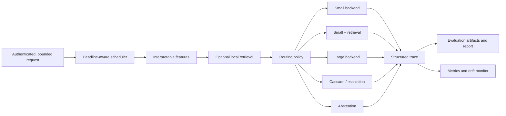

# BudgetRoute-LLM

BudgetRoute-LLM is a quality-aware language-model inference system. It estimates request difficulty, optionally retrieves local context, and selects a small model, larger model, retrieval-assisted small model, confidence cascade, or abstention. Its experiment harness measures the resulting quality–latency trade-off rather than assuming one policy is universally best.

> **Status: v0.4 research implementation. No official comparative benchmark result is claimed.** Pinned data/models, cache replay, calibrated routing, dynamic scheduling, local OpenAI-compatible runtimes, operational monitoring, and one small CPU acceptance run are validated. Run representative quality and load experiments on your target deployment before making performance claims. Fake mode remains software-path evidence only.

## Problem and research questions

Language-model deployments often send every prompt to one model, even when requests differ sharply in difficulty and context needs. BudgetRoute-LLM asks:

> Can a quality-aware routing policy reduce average inference latency and compute usage while keeping answer quality above a configured target?

The project also examines where retrieval helps, when cascade escalation is precise, how confidence calibration affects routing, and how thresholds move quality, coverage, latency, and compute together.

## Architecture



Protocols decouple generation backends, embedders, retrievers, policies, and evaluators. Pydantic schemas form the boundaries; YAML composition selects implementations. See [architecture](docs/architecture.md).

## Features

- Four explicit modes: deterministic fake, real CPU smoke, local GPU, and FastAPI service.
- Fixed, seeded-random, heuristic, learned, retrieval-first, and cascade policies.
- Deterministic feature extraction with no target leakage.
- Revision-pinned GSM8K, MMLU, and HotpotQA adapters with license metadata, content hashes, and immutable materialization manifests.
- Content-addressed generation caching and model-free policy replay with exact live/replay agreement checks.
- Length-normalized token likelihood, sequence log-probability, token entropy, and explicit uncalibrated/calibrated confidence fields.
- Group-disjoint train/calibration/test router partitions, temperature calibration, and calibration-only threshold selection.
- Bounded deadline-aware API scheduling, ordered backend waves, configurable concurrency, and true padded Transformers batches.
- Thread-safe load telemetry plus load-aware and configurable quality/cost/latency utility policies.
- Local OpenAI-compatible backend for vLLM, llama.cpp server, Ollama, and compatible chat-completions runtimes.
- Explicit human-review outcomes, rolling feature-shift alerts, Prometheus metrics, and aggregate feedback.
- Optional API-key authentication, trusted-host validation, per-process rate limits, request-body limits, secure headers, and overload responses.
- Portable NumPy exact-cosine retrieval plus optional FAISS packaging support.
- Lazy Transformers model loading, CPU/CUDA selection, mixed precision, optional quantization, and `torch.compile` controls.
- Exact match, token F1, numeric, classification, keyword, abstention, routing, selective, and calibration metrics.
- High-resolution route/retrieval/generation/total timing, token usage, RSS, and optional peak CUDA memory.
- Unique, atomic experiment artifacts and reports generated only from saved results.
- Offline tests, FastAPI endpoints, async microbatching, Docker, CI, and Windows/Unix scripts.

## Execution modes

| Mode | Purpose | Network/GPU needed? | Configuration |
|---|---|---|---|
| Fake | Tests, CI, demos, API smoke | No | `configs/serving/fake.yaml` |
| CPU smoke | Validate pinned Transformers and public-data integration | Model/data download, no GPU | `configs/benchmarks/real-cpu-gsm8k-smoke.yaml` |
| Local GPU | Real quality/performance experiments | Model download and CUDA | `configs/benchmarks/full.yaml` |
| Local model servers | vLLM/llama.cpp/Ollama-compatible serving | Running local endpoints | `configs/serving/local-openai-compatible.yaml` |
| API | Serve any of the above | Depends on selected config | `configs/serving/*.yaml` |

Fake answers, confidence, and artificial latency are deterministic and marked `fake: true`. They must never be reported as real performance.

## Repository map

```text
src/budgetroute/      package: backends, retrieval, routing, inference, evaluation, API
configs/              composable model, dataset, routing, benchmark, and serving YAML
data/                 original development corpus and 12-record benchmark
tests/                offline unit, integration, and timing tests
docs/                 architecture, methods, operations, security guidance, decisions
scripts/              PowerShell and Bash setup/check/demo entry points
outputs/              ignored experiment directories; only .gitkeep is tracked
.github/workflows/    quality, packaging, and clearly labeled fake-smoke CI
```

## Installation

Python 3.11 or 3.12 is the primary target. Python 3.13 is accepted by the package and used by the initial local validation.

### Windows PowerShell

```powershell
py -3.12 -m venv .venv
.\.venv\Scripts\python -m pip install --upgrade pip
.\.venv\Scripts\python -m pip install -e ".[dev]"
```

Or run `powershell -ExecutionPolicy Bypass -File scripts/bootstrap.ps1`.

### Linux or macOS

```bash
python3.12 -m venv .venv
./.venv/bin/python -m pip install --upgrade pip
./.venv/bin/python -m pip install -e '.[dev]'
```

Or run `bash scripts/bootstrap.sh`. Neither script pretends that activation persists after it exits.

Install optional real-model and public-dataset support with `pip install -e '.[dev,transformers,datasets]'`. The `all` extra adds API, learned-router, reporting, datasets, Transformers, and GPU helper dependencies; platform-specific CUDA and quantization support may still require separate setup.

## Quick fake demo

```powershell
.\.venv\Scripts\python -m budgetroute demo --config configs/serving/fake.yaml
```

```bash
./.venv/bin/python -m budgetroute demo --config configs/serving/fake.yaml
```

The five cases demonstrate easy-to-small, difficult-to-large, retrieval, cascade escalation, and abstention. Timing is simulated.

## Fake benchmark and report

```bash
python -m budgetroute benchmark --config configs/benchmarks/fake-smoke.yaml
python -m budgetroute generate-report --latest
```

The run writes `config.resolved.yaml`, environment/Git metadata, predictions, routes, timings, errors, metrics, Markdown/CSV, and PNG figures under an ignored `outputs/<UTC>_fake-smoke/` directory. Reports carry a prominent fake warning.

## CPU smoke test

```bash
pip install -e '.[transformers,datasets,reporting]'
python -m budgetroute materialize-dataset --spec configs/datasets/gsm8k.yaml --output data/materialized/gsm8k-cpu-smoke.jsonl --limit 10
python -m budgetroute doctor --config configs/benchmarks/real-cpu-gsm8k-smoke.yaml
python -m budgetroute collect-baselines --config configs/benchmarks/real-cpu-gsm8k-smoke.yaml
python -m budgetroute replay-benchmark --config configs/benchmarks/real-cpu-gsm8k-smoke.yaml
python -m budgetroute verify-replay --config configs/benchmarks/real-cpu-gsm8k-smoke.yaml --sample-size 1
```

This downloads revision-pinned Apache-2.0 SmolLM2 examples and a revision-pinned MIT GSM8K split from Hugging Face. Downloads, materialized data, model caches, and generation caches are ignored by Git. The smoke workload validates integration and is not a statistically meaningful result.

The complete collect/replay/calibrate methodology is documented in [the real evaluation workflow](docs/real-evaluation-workflow.md).

## Local GPU benchmark

```bash
pip install -e '.[all]'
python -m budgetroute doctor --config configs/benchmarks/full.yaml
python -m budgetroute benchmark --config configs/benchmarks/full.yaml
```

The example Qwen model sizes are configuration examples, not claims that they fit every GPU. Adjust identifiers, precision, quantization, generation length, batch size, and measured runs for available VRAM. Explicit CUDA requests never silently fall back to CPU.

## CLI

Both `budgetroute ...` and `python -m budgetroute ...` work.

```text
doctor             inspect dependencies, CUDA, config, and output access
validate-config    resolve and validate YAML composition
security-check     audit deployment-sensitive settings without printing secrets
inspect-data       validate benchmark JSONL and show category counts
materialize-dataset download a pinned public split and write a hash manifest
build-index        build and persist the configured retrieval index
benchmark          run configured policies and save artifacts
collect-baselines  generate small/large outcomes once and populate the cache
replay-benchmark   evaluate policies from cache without loading model weights
verify-replay      compare live and cached semantic responses exactly
train-router       train a fake-demo or real learned router from artifacts
evaluate-router    evaluate persisted router predictions and calibration
calibrate-confidence fit a portable small-backend correctness calibrator
generate-report    create report files from existing artifacts only
serve              start FastAPI with the selected configuration
demo               run the offline five-case fake demonstration
```

Use `python -m budgetroute COMMAND --help` for options.

## API

Start fake mode:

```bash
python -m budgetroute serve --config configs/serving/fake.yaml
```

Endpoints are `GET /healthz`, `GET /readyz`, `GET /metrics`, `GET /v1/config`, `GET /v1/monitoring`, `POST /v1/route`, `POST /v1/generate`, and optional `POST /v1/feedback`.

```bash
curl -s http://127.0.0.1:8000/healthz
curl -s -X POST http://127.0.0.1:8000/v1/route \
  -H 'Content-Type: application/json' \
  -d '{"prompt":"What is the capital of France?"}'
curl -s -X POST http://127.0.0.1:8000/v1/generate \
  -H 'Content-Type: application/json' \
  -d '{"prompt":"According to the project corpus, what is the internal project codename?","requires_retrieval":true}'
```

OpenAPI is available at `/docs`. Loopback development remains authentication-optional. Non-loopback binding is rejected unless API-key authentication is enabled.

## Secure API setup

Generate a secret outside the repository, set `BUDGETROUTE_API_KEY` through your shell or orchestrator, edit `api.trusted_hosts` for the real hostname, then validate and serve:

```powershell
$env:BUDGETROUTE_API_KEY = (New-Guid).Guid + (New-Guid).Guid
python -m budgetroute security-check --config configs/serving/secure.yaml
python -m budgetroute serve --config configs/serving/secure.yaml
```

Terminate TLS at a trusted reverse proxy and restrict model-runtime ports at the network layer. In-process authentication, limits, telemetry, and queues are useful single-instance controls; they are not a distributed gateway or tenant-isolation boundary. See [deployment](docs/deployment.md) and [the security policy](SECURITY.md).

## Local OpenAI-compatible runtimes

`configs/serving/local-openai-compatible.yaml` targets two loopback chat-completions endpoints. Start compatible servers separately, set their model IDs and ports in the profile, then run `doctor` before serving. Remote endpoints are denied by default; explicit remote opt-in additionally requires HTTPS. Credentials, when needed, are read only from the configured environment-variable name.

## Dataset format

Each UTF-8 JSONL line includes `id`, `group_id`, source provenance, `category`, `prompt`, `reference_answer`, `evaluation_type`, `requires_retrieval`, `must_abstain`, and `metadata`:

```json
{"id":"numeric_001","group_id":"problem-family-001","source":"example/source","source_split":"test","category":"numeric_reasoning","prompt":"A box contains 12 items and 3 are removed. How many remain?","reference_answer":"9","evaluation_type":"numeric","requires_retrieval":false,"must_abstain":false,"metadata":{}}
```

The bundled 12-record sample validates architecture only. It is original project data, not a conclusive benchmark. See [data guidance](data/README.md).

## Routing policies

- `always_small` and `always_large`: cost/quality baselines.
- `random`: seeded deterministic selection with configurable probabilities.
- `heuristic`: transparent request length, math/code, output length, category, and retrieval rules.
- `learned`: calibrated scikit-learn prediction of small-model success, trained with group-safe train/calibration/test partitions.
- `retrieval_first`: queries local context before backend selection.
- `cascade`: runs small first and escalates below a configured confidence threshold.
- `load_aware`: combines difficulty with trusted backend utilization and observed latency, using cascade or explicit human review under pressure.
- `budget_aware`: scores routes with configured quality, latency, and cost-unit weights and enforces an optional per-request estimate ceiling.
- Abstention is a route emitted when required context or answerability is insufficient.
- Human review is a distinct route response; the project does not pretend to provide a durable review queue.

See [routing](docs/routing.md) for failure modes and threshold interpretation.

## Evaluation metrics

Quality includes normalized exact match, token F1, numeric correctness, classification accuracy, keyword coverage, abstention correctness, routing accuracy, escalation precision/recall, false escalation/non-escalation, coverage, selective accuracy, Brier score, expected calibration error, and reliability bins.

Systems measurements include p50/p95 (and p99 when sample size permits), queue/routing/retrieval/generation/escalation/total latency, batch size, TTFT where available, throughput, token counts/rate, configured cost units, RSS, optional peak CUDA memory, failures, escalations, and route shares. Definitions and edge cases are in [evaluation](docs/evaluation.md).

## Reproducibility

Every run records UTC ID, configuration and dataset hashes, validated dataset manifest, exact model/tokenizer revisions, generation cache mode, replay status, seed, package version, backend metadata, environment/hardware, Git commit and dirty state, warm-up/measured counts, batch size, and concurrency. Model download time is excluded from steady-state timing. See [reproducibility](docs/reproducibility.md).

## Development and testing

```bash
python -m ruff format --check .
python -m ruff check .
python -m mypy src
python -m pytest
python -m pytest --cov=budgetroute --cov-report=term-missing --cov-fail-under=75
python -m build
```

PowerShell users can run `scripts/check.ps1`; Unix users can run `scripts/check.sh`. Ordinary tests do not use the network, CUDA, Docker, Hugging Face authentication, or model downloads.

## Docker

```powershell
$env:BUDGETROUTE_API_KEY = (New-Guid).Guid + (New-Guid).Guid
docker compose up --build
curl http://127.0.0.1:8000/readyz
```

The CPU-safe image runs authenticated fake API mode as a non-root user and downloads no models during build. Compose refuses to start until `BUDGETROUTE_API_KEY` is supplied; send it as a Bearer token to `/v1/*`. Mount a model cache and install the appropriate runtime dependencies when adapting it for real CPU/GPU service; see [deployment](docs/deployment.md).

## Limitations

- The sample is tiny, authored for development, and cannot establish external validity.
- Quality, confidence, and latency depend on model, prompt formatting, data, hardware, drivers, and runtime.
- Fake mode simulates behavior and is never evidence of actual model quality or speed.
- Token likelihood is a real model signal but is not correctness probability; task-specific calibration remains mandatory.
- Exact deterministic metrics do not fully evaluate open-ended usefulness or safety.
- The portable retriever is lexical feature hashing plus exact search, not a production semantic index.
- The scheduler, API-key limiter, feedback aggregates, metrics, and drift window are local-process only; replicas need shared gateway and telemetry infrastructure.
- Padded Transformers batching is implemented, but no speedup is claimed until measured on the target model, hardware, batch mix, and runtime.
- The OpenAI-compatible adapter targets the portable chat-completions subset; vendor extensions and tokenization details vary.
- Human review is an explicit outcome only, not a durable case-management integration.

See [limitations](docs/limitations.md) for details.

## Roadmap

Pinned datasets, replay, calibration, dynamic batching, local-server backends, adaptive routing, and single-process production guardrails are complete. Future work centers on distributed scheduling, durable review/feedback workflows, semantic retrieval, and multi-host load testing. See [ROADMAP](ROADMAP.md).
