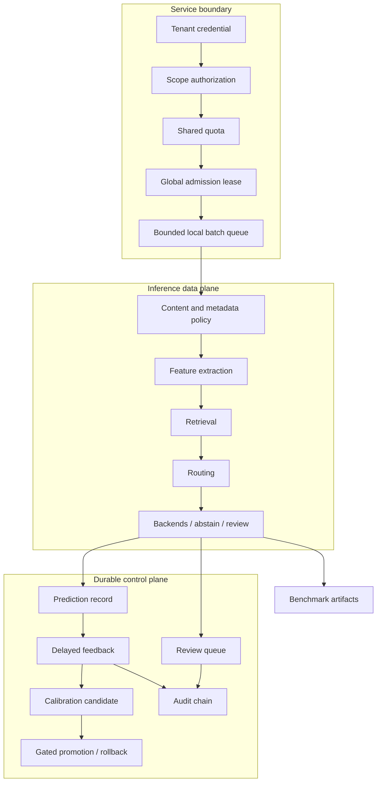

# Architecture

BudgetRoute-LLM separates research data flow from the operational control plane. The same typed inference service powers benchmarks, CLI demos, and FastAPI; service-only concerns remain outside model and policy implementations.

## Request lifecycle

1. FastAPI bounds the body, validates the Host, authenticates an environment-backed credential, and checks the endpoint scope.
2. `OperationalStore` consumes a tenant quota and, for generation, acquires an expiring global admission lease. SQLite coordinates processes on one host; PostgreSQL coordinates replicas on independent hosts.
3. The local `AsyncInferenceBatcher` applies bounded admission, queue deadlines, ordered batching, and graceful shutdown.
4. Pydantic validates the request; `ContentPolicy` bounds metadata shape and optionally rejects configured input substrings without echoing content.
5. `RequestFeatureExtractor` creates deterministic, interpretable features. Retrieval may run before the final policy decision.
6. A policy returns a `RouteDecision`; `InferenceEngine` executes small, retrieval-assisted small, large, cascade, abstention, or human review.
7. Output policy runs before release. The response carries route, execution, usage, uncertainty, retrieval, cost estimate, and separated timing.
8. Monitoring retains bounded aggregate/numeric state. The durable store records a privacy-minimal prediction and creates a review case when configured.
9. Delayed feedback joins on tenant/request ID. Review and feedback mutations append audit events.
10. Operator-invoked adaptation evaluates immutable calibration candidates and atomically promotes only candidates that pass explicit gates.

## Core boundaries

- `GenerationBackend`: lifecycle, single/batch generation, health, token counting, metadata, and cleanup.
- `RoutingPolicy`: request features and trusted runtime state to a typed route decision.
- `Retriever`/index: normalized embeddings and typed chunks to ranked evidence.
- `OperationalStore`: quotas, leases, metrics, predictions, feedback, review state, and audit verification.
- `Evaluator`: a benchmark record and answer to deterministic quality evidence.
- Artifact writers: atomic, unique run output without invented values.

Fake, Transformers, and OpenAI-compatible backends remain interchangeable. Imports never download or initialize model weights.

## Scheduling and coordination

Local batching and global admission solve different problems. `AsyncInferenceBatcher` groups work within one process and enforces queue/deadline bounds. Admission leases cap aggregate inflight generation across every replica sharing the selected store; a request heartbeat renews active work and expiry recovers capacity after a crashed worker. Fixed-window quotas are transactional per tenant. A database-backed lease is not a durable request queue: prompts are deliberately not persisted and disconnected HTTP work is not replayed.

SQLite uses WAL, foreign keys, busy timeouts, and immediate transactions. It is a credible single-host backend. PostgreSQL uses a bounded Psycopg pool, database time, atomic upserts/constraints, row locks for review state, and transaction-scoped advisory locks for migrations, lease admission, and audit-head serialization. Those critical sections contain only short SQL work; model execution happens after the lease transaction commits.

Packaged PostgreSQL migrations apply in filename order under a global migration lock and record a SHA-256 checksum. Production can disable automatic migration: a DDL-capable init job runs `migrate-store`, while API replicas use a narrower runtime credential and verify that the schema is complete and unmodified. Unknown, missing, or edited migrations fail startup. This is single-primary transactional coordination, not multi-region active/active consensus.

Readiness probes combine inference health with an operational-store query and return HTTP 503 if either dependency is unavailable. They do not prove downstream model quality, database replication health, or fleet capacity.

## Operational records and privacy

Predictions retain tenant/request IDs, route, raw/calibrated confidence, numeric features, and timestamps. Feedback retains the correctness label. Review cases retain state and correlation metadata, not prompts or generated answers. Audit entries retain actor/action/target/details and link hashes. Secrets never enter these tables.

The audit chain detects edits or broken continuity in retained application events. Retention may remove the old prefix; the first retained event therefore anchors to its historical predecessor hash. The chain is not externally notarized and a database administrator can replace the whole database.

## Adaptation boundary

Online adaptation is intentionally an offline control-plane command, not request-path self-modification. Labels are ordered chronologically, the newest fraction is held out, and candidate temperature calibration is compared with the active calibrator using Brier and ECE gates. Candidate files are immutable; active materialization and the manifest are atomically replaced. Page-Hinkley flags upward error changes but never auto-promotes or auto-rolls back.

Retrieval-benefit learning is a separate artifact because “small model succeeds” and “retrieval improves the answer” are different targets. Paired policy rows define the latter label, related groups remain together, and inference falls back safely when no useful retrieval is predicted.

## Retrieval

Document loading and chunking are deterministic. Embedders produce normalized vectors. Exact NumPy and FAISS-flat indexes provide exact inner-product search; FAISS HNSW provides approximate search with explicit graph/search parameters. Portable vectors and chunk metadata persist in NPZ, so an HNSW graph can be rebuilt rather than binding artifacts to a FAISS binary format. Semantic model identifier and exact revision are part of metadata.

## Monitoring and artifacts

`RuntimeMonitor` stores a bounded numeric/category window only. Drift combines normalized mean and q10/q50/q90 changes with category total variation. Shared store summaries cover recent durable prediction features. Neither signal proves label, semantic, or safety drift.

Benchmark runs record resolved configuration, hashes, Git/environment state, model revisions, backend metadata, predictions, routes, timings, errors, metrics, and reports. Generation replay implements the backend protocol, allowing policy evaluation over fixed model outcomes while remaining visibly distinct from live systems evidence.
